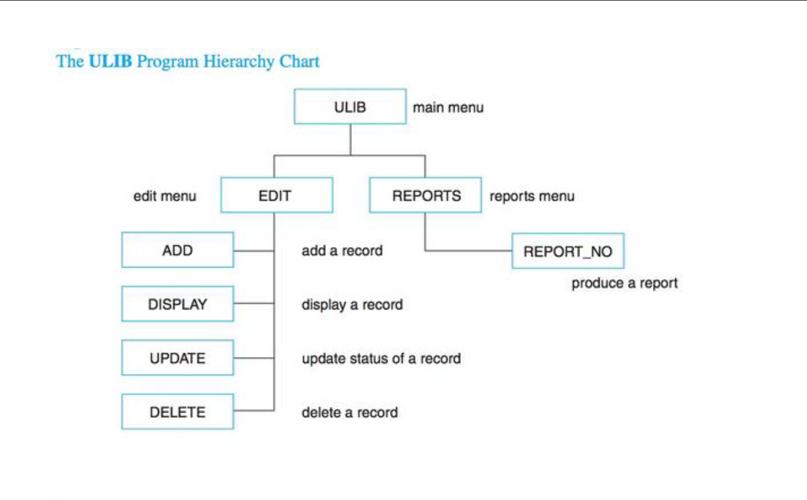

<picture>
  <source
    srcset=".github/mjc_logo_reverse.svg"
    media="(prefers-color-scheme: dark)"
  />
  <source
    srcset=".github/mjc_logo.svg"
    media="(prefers-color-scheme: light), (prefers-color-scheme: no-preference)"
  />
  

</picture>

# Introduction to Unix/Linux Systems (CSCI 210)
> **Note**: this repository is not maintained and is archived for historical purposes. The code may not work as intended and may contain security vulnerabilities. Use at your own risk.


 

## Final Project: ULIB
Library management system built with Bash that allows a user to create, read, update, and delete books in a library. The program also allows a user to check out and return books. Program data is stored in a text file.

## Program Hierachy


## Installation
To clone and run these files, you must have [Bash](https://www.gnu.org/software/bash/) installed on your local machine.

### From the terminal
```bash
# Clone this repository
$ git clone https://github.com/4N0NYM0U5MY7H/CSCI210_ULIB.git

# Go into the ulib directory
$ cd CSCI210_ULIB/ULIB

# Make the files executable
$ chmod +x *.sh

# Run the program
$ ./ULIB.sh
```

### From GitHub
1. Click the green **Code** button in the top right corner of the repository.
2. Click **Download ZIP**.
3. Extract the ZIP file.
4. Set the files to be executable.
5. Run the program.

### More options
For more cloning options, please visit the [GitHub Docs page for cloning a repository](https://docs.github.com/en/github/creating-cloning-and-archiving-repositories/cloning-a-repository).

## Built with
- [](https://www.gnu.org/software/bash/)

## License
This project is licensed under the MIT License. See the [LICENSE](LICENSE) file for details.
